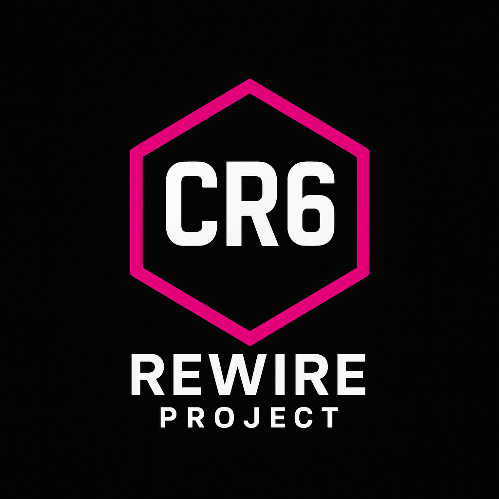

# CR-6 Rewire Project

---

## About

**CR-6 Rewire** is a personal modification project for the **Creality CR-6 SE** 3D printer.  
It is inspired by the **Voron Switchwire** and its derivative, the **Enderwire**, but adapted for the CR-6 SE platform.  

This is **not a full printer conversion**, but rather a collection of modifications and adaptations that reuse ideas and parts from the Switchwire/Enderwire projects.

Some components will be slightly modified or redesigned to fit the CR-6 SE.

---

## Motivation

This project is something I am doing **purely for myself and my sister** to create a functional and reliable printer.

**I cannot and will not invest a large amount of time into documentation, support, or development.**

However, since I am **using resources from the open-source community**, I want to give back by making my modifications available – even if only in a basic and incomplete form.  
That way, others may reuse or build upon them if they wish.

---

## Disclaimer

- This is a **hobby project**.  
- Use at your own risk.  
- Do not expect regular updates or active support.  
- Feel free to fork, reuse, or improve on your own.  

---

## Inspiration & Credits

- [Voron Design – Switchwire](https://github.com/VoronDesign/Voron-Switchwire)  
- [Enderwire](https://github.com/boubounokefalos/Ender_SW)  
- Creality CR-6 SE  

---

## License

This project is released under the **GPLv3 License**.  
Feel free to use, modify, and redistribute, as long as you respect the same license.  

---

## Acknowledgements

Big thanks to the **Voron Design team** and the **open-source 3D printing community** – without their work and willingness to share, this and many other projects would not exist.  

---

*"If you benefit from open source, give something back – no matter how small."*
